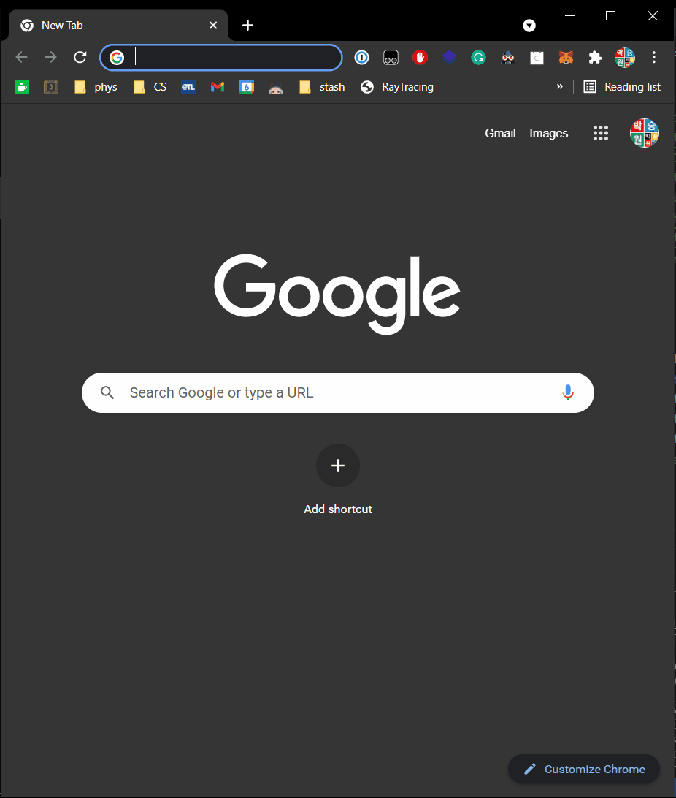

# userscripts
Personal collection of userscripts (I use Tampermonkey)

- `annoying_snu_password.js` - Skip a prompt that asks to change password at every SNU websites.
- `slido_login_autofill.js` - Autofill passcode, name and checkbox.
  - You need to edit the passcode & name. 
  - Every time, click "Full Name" text area before clicking "Join Event". (Of course, this is not really convenient and there must exist a room for improvement here; I'm not an expert on web programming things, so any suggestion/PRs would be highly appreciated.)

